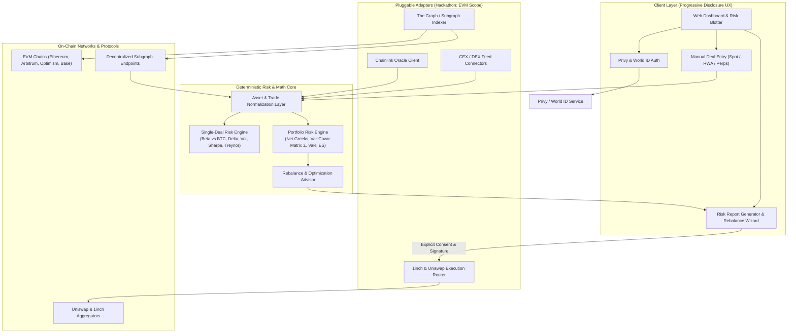

# Agentic Risk Manager 🛡️📊

An institutional-grade, non-custodial crypto portfolio risk manager that delivers real-time risk quantification, Greek factor decomposition, tail-risk metrics, and actionable rebalancing recommendations across Spot, Tokenized RWAs, and Perpetual/Derivative contracts.

---

## 🌟 Executive Summary

Managing risk across decentralized finance (DeFi) and centralized venues is plagued by multi-chain fragmentation, opaque calculations, and custodial vulnerabilities. 

**Crypto Risk Manager** bridges the gap between traditional quantitative finance risk management and Web3:
- **Zero Private Key Custody**: Connect securely via **Privy**, **World ID**, or standard Web3 wallets.
- **Automated Multi-Chain Discovery**: Index on-chain token balances and derivative holdings seamlessly through **The Graph** subgraphs and RPCs.
- **Institutional Multi-Asset Modeling**: Manage Spot Crypto, Tokenized Real-World Assets (RWAs), and Perpetual Futures in one unified portfolio.
- **Deterministic Math Engine**: Analyze single-deal metrics (Beta vs. BTC, Delta, Volatility, Std Dev, Sharpe, Treynor) and portfolio aggregates (Net Delta, Net Vega, Net Gamma, Variance-Covariance matrix, VaR, Expected Shortfall).
- **Consensual Rebalancing**: Formulate mathematical rebalancing proposals and execute them exclusively upon explicit user confirmation via **Uniswap** and **1inch** EVM routes.

---

## 🏛️ Core Principles & Constitutional Guardrails

The project adheres to the non-negotiable governance principles defined in the [Project Constitution](file:///.specify/memory/constitution.md):

| Principle | Description |
| :--- | :--- |
| **I. Non-Custodial by Default** | Private keys are never held or requested. Identity and wallet sessions are managed via **Privy** and **World ID**; holdings are discovered via **The Graph** and public read-only RPCs. |
| **II. Read-First, Execute-Only-on-Consent** | Discovery and risk evaluations run in read-only mode. Even when the engine recommends optimal rebalancing trades, execution via **1inch** or **Uniswap** requires explicit user consent and wallet signatures. |
| **III. Deterministic, Versioned Risk Math** | All risk formulas (Single-deal Beta vs. BTC, Sharpe & Treynor with $R_f = 0$, Net Greeks, VaR, Expected Shortfall) are version-controlled, fully deterministic, and verified with analytical test suites. |
| **IV. Data Provenance & Graceful Degradation** | Ingest data from **Chainlink** oracles, centralized exchange feeds (CEX), and DEX subgraphs with timestamps and source tags. If a provider fails or lags, the system degrades gracefully with clear staleness indicators. |
| **V. Agnostic Core with Pluggable Adapters** | The domain model remains asset- and chain-agnostic. For hackathon delivery, transaction execution and protocol adapters are scoped to **EVM networks**. |
| **VI. Observability & Auditability** | Every metric, covariance matrix entry, and rebalancing step is traceable and transparently explainable to eliminate black-box recommendations. |
| **VII. Progressive Disclosure UX** | Surfaces high-level portfolio health and net Greek exposures immediately, while enabling drill-downs into position-level sensitivity, risk reports, and scenario stress tests. |

---

## 🚀 Key Features

### 1. Non-Custodial Authentication & Auto-Discovery
- **Web3 & Social Login**: Frictionless authentication with **Privy** (embedded wallets, social logins) and sybil-resistant identity verification via **World ID**.
- **Multi-Chain Portfolio Indexing**: Automatically discovers ERC-20 token balances, liquidity positions, and protocol commitments across EVM chains using **The Graph** subgraphs.

### 2. Multi-Asset Trade Blotter & Deal Entry
Support for manual trade entries across three major asset classes:
- **Spot Crypto**: Major layer-1/2 tokens, DeFi tokens, and stablecoins.
- **Tokenized RWAs**: Tokenized treasuries, private credit, and real-world asset contracts.
- **Perpetuals & Derivatives**: Synthetic positions and perpetual contracts with leverage, margin, and strike/settlement attributes.
- **Blotter Attributes**: Asset Class, Crypto Symbol, Deal Date, Buy/Sell Direction, Trade Type, Settlement Date, Notional Size, and Execution Exchange/Venue.

### 3. Single-Deal Risk Analytics
Instant sensitivity and risk decomposition for each trade and position:
- **Beta ($\beta_{BTC}$)**: Systematic risk benchmarked against Bitcoin ($BTC$) as the primary market index.
- **Delta ($\Delta$)**: First-order directional price sensitivity.
- **Volatility ($\sigma$)**: Period and annualized asset return volatility.
- **Standard Deviation**: Asset variance and historical dispersion.
- **Sharpe Ratio**: Risk-adjusted excess return per unit of volatility (assuming $R_f = 0$).
- **Treynor Ratio**: Risk-adjusted excess return per unit of systematic risk (assuming $R_f = 0$).

### 4. Portfolio-Level Quantitative Risk Engine
Comprehensive multi-asset risk synthesis across all positions:
- **Net Portfolio Greeks**:
  - **Net Delta ($\Delta_{net}$)**: Aggregate directional market exposure.
  - **Net Vega ($\nu_{net}$)**: Exposure to shifts in implied market volatility.
  - **Net Gamma ($\Gamma_{net}$)**: Convexity and acceleration of Delta relative to price moves.
- **Variance-Covariance Matrix ($\Sigma$)**: High-dimension correlation and covariance tracking across all held assets.
- **Portfolio Sharpe & Treynor Ratios**: Portfolio-wide risk efficiency relative to total volatility and systematic Bitcoin risk.

### 5. Tail-Risk Metrics & Rebalancing Engine
- **Value at Risk (VaR)**: Parametric and Historical VaR at 95% and 99% confidence horizons.
- **Expected Shortfall (ES / CVaR)**: Conditional Value at Risk measuring average losses beyond the VaR threshold.
- **Risk Audit Reports**: One-click generation of comprehensive risk health reports.
- **Actionable Rebalancing**: Algorithmic suggestions to reduce concentration risk, hedge net Greek exposures, or optimize Sharpe efficiency, with route execution via **1inch** and **Uniswap** requiring explicit user sign-off.

---

## 📐 Mathematical Models & Conventions

| Metric | Formulation | Reference / Baseline |
| :--- | :--- | :--- |
| **Reference Benchmark** | $I_{ref} = \text{Bitcoin (BTC)}$ | Primary benchmark for systematic risk ($\beta$) |
| **Risk-Free Rate ($R_f$)** | $R_f = 0.00\%$ | Standard crypto-native baseline assumption |
| **Single Deal Beta ($\beta_i$)** | $\beta_i = \frac{\text{Cov}(R_i, R_{BTC})}{\text{Var}(R_{BTC})}$ | Sensitivity of asset $i$ to BTC market moves |
| **Sharpe Ratio ($S_i$)** | $S_i = \frac{\mathbb{E}[R_i] - R_f}{\sigma_i}$ | Risk-adjusted return per unit of total risk |
| **Treynor Ratio ($T_i$)** | $T_i = \frac{\mathbb{E}[R_i] - R_f}{\beta_i}$ | Risk-adjusted return per unit of systematic risk |
| **Net Portfolio Delta** | $\Delta_{net} = \sum_{i=1}^{N} w_i \cdot \Delta_i$ | Total linear portfolio sensitivity |
| **Net Portfolio Gamma** | $\Gamma_{net} = \sum_{i=1}^{N} w_i \cdot \Gamma_i$ | Total portfolio convexity |
| **Net Portfolio Vega** | $\nu_{net} = \sum_{i=1}^{N} w_i \cdot \nu_i$ | Total sensitivity to 1% shift in implied volatility |
| **Value at Risk ($\text{VaR}_\alpha$)** | $\text{VaR}_\alpha = - \inf \{ l \in \mathbb{R} : P(L > l) \le 1 - \alpha \}$ | Maximum expected loss at $\alpha = 95\%, 99\%$ |
| **Expected Shortfall ($\text{ES}_\alpha$)** | $\text{ES}_\alpha = \mathbb{E}[L \mid L \ge \text{VaR}_\alpha]$ | Average tail loss beyond the VaR cutoff |

---

## 🏗️ System Architecture



---


## 🛠️ Technology Stack

- **Frontend & UX**: Modern TypeScript, React / Vite, Vanilla CSS with curated dark-mode palette and progressive disclosure design patterns.
- **Authentication**: [Privy](https://www.privy.io/) (embedded wallets & social authentication) and [World ID](https://worldcoin.org/world-id) (sybil-resistance).
- **On-Chain Indexing**: [The Graph](https://thegraph.com/) protocol subgraphs and ethers.js / viem EVM read-only RPCs.
- **Oracles & Pricing**: [Chainlink](https://chain.link/) decentralized price feeds paired with CEX/DEX historical data feeds with timestamped provenance.
- **Execution Routing**: [1inch API](https://1inch.io/) & [Uniswap V3/V4](https://uniswap.org/) SDK with strict user consent gates.
- **Quantitative Engine**: Pure, deterministic TypeScript mathematical library with zero side effects and automated test fixtures.

---

## 🚀 Quick Start

### Prerequisites
- Node.js (v18.0.0 or higher)
- npm / yarn / pnpm

### Installation

1. **Clone the repository:**
   ```bash
   git clone https://github.com/your-username/agentic_risk_manager.git
   cd agentic_risk_manager
   ```

2. **Install dependencies:**
   ```bash
   npm install
   ```

3. **Configure Environment Variables:**
   Copy the sample environment file and configure your provider keys:
   ```bash
   cp .env.example .env
   ```
   Provide:
   - `VITE_PRIVY_APP_ID`: Your Privy Application ID
   - `VITE_WORLD_ID_APP_ID`: Your World ID App ID
   - `VITE_GRAPH_API_KEY`: The Graph decentralized network API key
   - `VITE_1INCH_API_KEY`: 1inch developer portal API key

4. **Run the Development Server:**
   ```bash
   npm run dev
   ```

5. **Run Mathematical Verification Tests:**
   ```bash
   npm test
   ```

---

## ☁️ Google Cloud Deployment (Zero Docker)

Deploy the entire full-stack application (FastAPI backend + Next.js frontend) to Google Cloud Platform using serverless Cloud Run with **Google Cloud Buildpacks**—requiring **zero local Docker installation, daemon, or container commands**.

### Prerequisites
1. Install the [Google Cloud CLI (`gcloud`)](https://cloud.google.com/sdk/docs/install).
2. Authenticate and configure your target project:
   ```bash
   gcloud auth login
   gcloud config set project YOUR_PROJECT_ID
   ```
3. Prepare configuration:
   ```bash
   cp .env.gcp.example .env.gcp
   ```

### One-Command Deployment

#### Windows PowerShell:
```powershell
.\deploy-gcp.ps1 -Region us-central1
```

#### Linux / macOS / Cloud Shell:
```bash
chmod +x deploy-gcp.sh
./deploy-gcp.sh --region us-central1
```

### What Happens Behind the Scenes
1. **Source-Based Buildpacks**: The deployment scripts upload `backend/` and `frontend/` source directories to Google Cloud Build. Remote buildpacks detect Python and Node.js runtimes automatically.
2. **Dynamic Entrypoint Binding**: Backend uses `backend/Procfile` to bind Uvicorn to Cloud Run's `$PORT`. Frontend starts Next.js with dynamic `$PORT` listening.
3. **Automated Inter-Service Wiring**: The backend URL is retrieved and injected as `NEXT_PUBLIC_API_URL` into the frontend service during deployment.
4. **Health Verification**: Queries `GET /health` on the deployed API to confirm operational readiness and database connectivity.

---

## 📖 Development & Spec Kit Workflow

This project is governed by **Spec Kit**:
- **Constitution**: View project rules and constraints in [.specify/memory/constitution.md](file:///.specify/memory/constitution.md).
- **Feature Specification**: Run `/speckit-specify` to define new feature specs.
- **Implementation Planning**: Run `/speckit-plan` to design technical architecture.
- **Task Generation**: Run `/speckit-tasks` to generate executable implementation checklists.
- **Implementation**: Run `/speckit-implement` to execute approved tasks.

---

## 📄 License & Compliance

Licensed under the [MIT License](LICENSE). All risk calculations are for decision-support and portfolio analysis; non-custodial execution remains strictly under user control.
