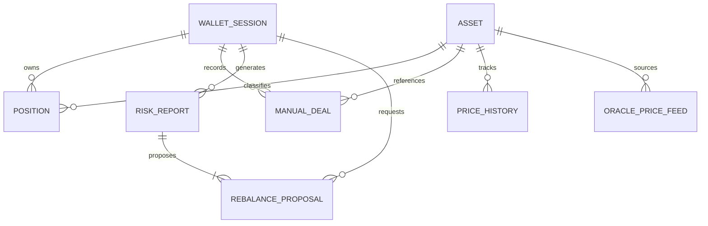

# Data Model: Agentic Crypto Risk Manager

This document defines the entity schemas, relationships, database tables (PostgreSQL + TimescaleDB), validation rules, and state transitions for the Crypto Risk Manager.

---

## 1. Entity Relationship Diagram



---

## 2. Core Entities & Database Schemas

### 2.1 `wallet_sessions`
Represents an authenticated non-custodial wallet session.

| Column | Type | Constraints | Description |
| :--- | :--- | :--- | :--- |
| `id` | `UUID` | `PRIMARY KEY` | Unique internal session ID |
| `address` | `VARCHAR(42)` | `NOT NULL, INDEX` | EVM wallet address (`0x...`) |
| `ens_name` | `VARCHAR(255)` | `NULLABLE` | Resolved ENS domain (e.g. `trader.eth`) |
| `auth_provider` | `VARCHAR(50)` | `NOT NULL` | `privy`, `world_id`, `injected` |
| `created_at` | `TIMESTAMPTZ` | `DEFAULT NOW()` | Session creation time |
| `last_active_at` | `TIMESTAMPTZ` | `DEFAULT NOW()` | Last activity timestamp |

### 2.2 `assets`
Reference registry for all supported crypto tokens, RWAs, and synthetic instruments.

| Column | Type | Constraints | Description |
| :--- | :--- | :--- | :--- |
| `id` | `VARCHAR(64)` | `PRIMARY KEY` | Standard identifier (e.g., `ETH`, `BTC`, `USDC`, `ONDO_USDY`) |
| `symbol` | `VARCHAR(32)` | `NOT NULL, INDEX` | Ticker symbol |
| `name` | `VARCHAR(128)` | `NOT NULL` | Human-readable name |
| `asset_class` | `VARCHAR(32)` | `NOT NULL` | Enum: `crypto`, `rwa`, `perpetual` |
| `decimals` | `INT` | `DEFAULT 18` | Standard token decimals |
| `is_benchmark` | `BOOLEAN` | `DEFAULT FALSE` | True for BTC (the systematic benchmark index) |
| `created_at` | `TIMESTAMPTZ` | `DEFAULT NOW()` | Record creation timestamp |

### 2.3 `positions`
Unified table of active holdings, combining auto-discovered on-chain tokens and manual entries.

| Column | Type | Constraints | Description |
| :--- | :--- | :--- | :--- |
| `id` | `UUID` | `PRIMARY KEY` | Unique position identifier |
| `wallet_address` | `VARCHAR(42)` | `NOT NULL, INDEX` | Foreign key to `wallet_sessions.address` |
| `asset_id` | `VARCHAR(64)` | `NOT NULL, REFERENCES assets(id)` | Asset identifier |
| `source_type` | `VARCHAR(32)` | `NOT NULL` | Enum: `on_chain_discovered`, `manual_entry` |
| `chain_id` | `INT` | `NULLABLE` | EVM Chain ID (1, 42161, 10, 8453, 137) |
| `quantity` | `NUMERIC(38, 18)`| `NOT NULL` | Holding amount (negative for short perps) |
| `unit_price_usd` | `NUMERIC(24, 8)` | `NOT NULL` | Latest marked USD price |
| `total_value_usd` | `NUMERIC(24, 2)` | `NOT NULL` | $quantity \times unit\_price\_usd$ |
| `updated_at` | `TIMESTAMPTZ` | `DEFAULT NOW()` | Last update timestamp |

### 2.4 `manual_deals`
Blotter table for user-entered trades and off-chain positions.

| Column | Type | Constraints | Description |
| :--- | :--- | :--- | :--- |
| `id` | `UUID` | `PRIMARY KEY` | Unique deal ID |
| `wallet_address` | `VARCHAR(42)` | `NOT NULL, INDEX` | Foreign key to `wallet_sessions.address` |
| `asset_name` | `VARCHAR(64)` | `NOT NULL` | Name / ticker of the asset |
| `trade_date` | `DATE` | `NOT NULL` | Date trade was executed |
| `side` | `VARCHAR(8)` | `NOT NULL` | Enum: `buy`, `sell` |
| `trade_type` | `VARCHAR(32)` | `NOT NULL` | Enum: `spot`, `forward`, `future`, `option_call`, `option_put` |
| `asset_class` | `VARCHAR(32)` | `NOT NULL` | Enum: `crypto`, `rwa`, `perpetual` |
| `settlement_date`| `DATE` | `NULLABLE` | Required for forwards, options, and RWAs |
| `venue` | `VARCHAR(64)` | `NOT NULL` | Venue/Exchange (e.g., `Binance`, `Deribit`, `Ondo`, `OTC`) |
| `quantity` | `NUMERIC(38, 18)`| `NOT NULL` | Position size |
| `cost_basis_usd` | `NUMERIC(24, 8)` | `NOT NULL` | Unit execution price in USD |
| `notes` | `TEXT` | `NULLABLE` | Optional user notes |
| `created_at` | `TIMESTAMPTZ` | `DEFAULT NOW()` | Record creation timestamp |

### 2.5 `price_history` (TimescaleDB Hypertable)
Time-series storage for daily close prices, returns, and oracle answers.

| Column | Type | Constraints | Description |
| :--- | :--- | :--- | :--- |
| `time` | `TIMESTAMPTZ` | `NOT NULL` | Timestamp (daily partition key) |
| `asset_id` | `VARCHAR(64)` | `NOT NULL, REFERENCES assets(id)` | Asset identifier |
| `price_usd` | `NUMERIC(24, 8)` | `NOT NULL` | Marked closing price in USD |
| `return_daily` | `NUMERIC(12, 6)` | `NULLABLE` | $\ln(P_t / P_{t-1})$ log return |
| `source` | `VARCHAR(32)` | `NOT NULL` | `chainlink`, `coingecko`, `defillama`, `navlink` |

*Hypertable Partitioning*: Partitioned by `time` with 7-day chunks.

### 2.6 `risk_reports`
Persisted historical risk audit reports.

| Column | Type | Constraints | Description |
| :--- | :--- | :--- | :--- |
| `id` | `UUID` | `PRIMARY KEY` | Report identifier |
| `wallet_address` | `VARCHAR(42)` | `NOT NULL, INDEX` | Portfolio owner address |
| `net_delta` | `NUMERIC(18, 4)` | `NOT NULL` | Net portfolio Delta |
| `net_gamma` | `NUMERIC(18, 6)` | `NOT NULL` | Net portfolio Gamma |
| `net_vega` | `NUMERIC(18, 4)` | `NOT NULL` | Net portfolio Vega |
| `var_95_usd` | `NUMERIC(24, 2)` | `NOT NULL` | 95% 1-day Value at Risk in USD |
| `var_99_usd` | `NUMERIC(24, 2)` | `NOT NULL` | 99% 1-day Value at Risk in USD |
| `es_95_usd` | `NUMERIC(24, 2)` | `NOT NULL` | 95% Expected Shortfall (CVaR) in USD |
| `es_99_usd` | `NUMERIC(24, 2)` | `NOT NULL` | 99% Expected Shortfall (CVaR) in USD |
| `sharpe_ratio` | `NUMERIC(8, 4)` | `NOT NULL` | Portfolio Sharpe ($R_f=0$) |
| `treynor_ratio` | `NUMERIC(8, 4)` | `NOT NULL` | Portfolio Treynor ($R_f=0$) |
| `matrix_snapshot`| `JSONB` | `NOT NULL` | Covariance matrix and weights snapshot |
| `created_at` | `TIMESTAMPTZ` | `DEFAULT NOW()` | Generation timestamp |

### 2.7 `rebalance_proposals`
Stores generated rebalance proposals, risk reduction simulations, and quotes.

| Column | Type | Constraints | Description |
| :--- | :--- | :--- | :--- |
| `id` | `UUID` | `PRIMARY KEY` | Proposal identifier |
| `report_id` | `UUID` | `REFERENCES risk_reports(id)` | Parent risk report |
| `status` | `VARCHAR(24)` | `NOT NULL` | Enum: `proposed`, `simulated`, `executed_by_user`, `rejected` |
| `actions_json` | `JSONB` | `NOT NULL` | Array of suggested swaps (source, target, amount, venue) |
| `quote_details` | `JSONB` | `NULLABLE` | 1inch Fusion / Uniswap quote response (calldata, slippage) |
| `risk_delta_json`| `JSONB` | `NOT NULL` | Before vs. after VaR, Net Greeks, and Sharpe delta |
| `created_at` | `TIMESTAMPTZ` | `DEFAULT NOW()` | Creation timestamp |

---

## 3. State Transitions

### Rebalance Proposal Lifecycle
```text
[Generated by Engine / Copilot]
             │
             ▼
        PROPOSED ────────────► REJECTED (Dismissed by user)
             │
             ▼ (User clicks "Review Quote")
        SIMULATED (Quotes fetched from 1inch / Uniswap; pre-flight modal displayed)
             │
             ▼ (User confirms and signs in personal wallet)
    EXECUTED_BY_USER (Transaction hash broadcast by client wallet)
```

**Guardrail**: The state can NEVER transition to `EXECUTED` automatically from the backend. The transition requires the client frontend to present a valid transaction hash signed by the user's connected wallet.
