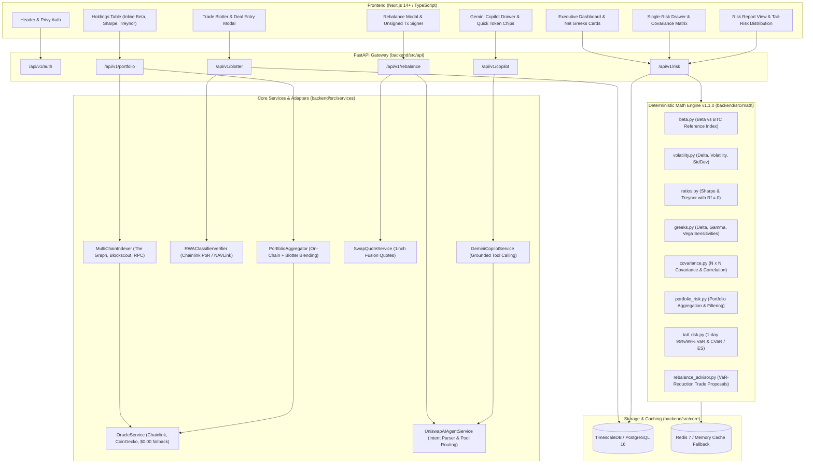

# Implementation Plan: Agentic Crypto Risk Manager (Consolidated Architecture)

**Branch**: `001-agentic-risk-manager` | **Spec**: [spec.md](file:///c:/Users/Karth/hacks-projects/agentic_risk_manager/specs/001-agentic-risk-manager/spec.md) | **Version**: 1.1.0 | **Ratified Date**: 2026-09-10

---

## 1. Executive Summary & Vision

The **Agentic Crypto Risk Manager** is an institutional-grade, non-custodial multi-asset risk management, portfolio analytics, and automated rebalancing advisory platform. Built to bring financial precision to the decentralized economy, it unifies:
1. **On-Chain Balance Discovery**: Automated, read-only multi-chain indexing across Ethereum, Arbitrum, Optimism, Base, and Polygon via The Graph Protocol subgraphs, Blockscout APIs, and native JSON-RPCs.
2. **Multi-Asset Manual Deal Blotter**: Persistence and valuation of off-chain CEX trades, OTC contracts, Perpetual futures, and Tokenized Real World Assets (RWAs) verified via Chainlink Proof of Reserve (PoR) and NAVLink.
3. **Deterministic Quantitative Risk Math Engine (v1.1.0)**: Analytical single-position metrics (Beta benchmarked against BTC, Delta, Volatility, StdDev, Sharpe & Treynor ratios at $R_f = 0$) and whole-portfolio Greek exposures (Net Delta, Net Vega, Net Gamma, symmetric $N \times N$ Variance-Covariance matrix).
4. **Institutional Tail-Risk Reports**: 1-day 95% and 99% Value at Risk (VaR) and Expected Shortfall (CVaR) with algorithmic rebalancing suggestions to reduce concentration and lower tail loss.
5. **Uniswap AI Hedging Agent & 1inch Fusion Routing**: Non-custodial conversational hedging agent converting vulnerable assets into USDC or ETH with un-signed transaction payloads requiring explicit user wallet signatures.
6. **Grounded AI Copilot**: Natural language conversational assistant powered by Google GenAI (Gemini) grounded with real-time portfolio state and quantitative risk tools.

---

## 2. Technical Context & Technology Stack

| Layer | Technologies & Dependencies | Purpose |
| :--- | :--- | :--- |
| **Backend Core** | Python 3.11+ / 3.12, FastAPI, Uvicorn, Pydantic v2 | High-concurrency RESTful API service |
| **Database & Cache** | PostgreSQL 16 (TimescaleDB), SQLAlchemy (asyncpg), Redis 7 (with memory fallback) | Relational deal persistence, time-series hypertable, cache |
| **Quantitative Math** | NumPy, SciPy | Deterministic vector and matrix operations, VaR/CVaR calculations |
| **External APIs & Indexing** | `httpx` (async), The Graph subgraphs, Blockscout REST v2, Public EVM RPCs | Multi-chain ERC-20 and native balance discovery |
| **Oracles & Pricing** | Chainlink feeds, CoinGecko API (batched, $0.00 zero-value unlisted handling) | Multi-tier market valuation and data provenance metadata |
| **AI & LLM Services** | `google-genai` (Gemini SDK) | Tool-calling copilot grounded in portfolio state and Uniswap hedging |
| **Frontend Framework** | Next.js 14+ (App Router), React 18, TypeScript | Institutional responsive web application |
| **Web3 & Authentication** | `@privy-io/react-auth`, Wagmi, Viem | Non-custodial wallet onboarding, session management, EIP-1193 signing |
| **Design & UI System** | Custom Vanilla CSS Design System (`theme.css`), Lucide React | Glassmorphism, tailored dark mode, high-contrast badges |

---

## 3. Constitution Alignment & Quality Gates

The implementation strictly satisfies all 7 Core Principles and 4 Quality Gates of the [Crypto Risk Manager Constitution](file:///c:/Users/Karth/hacks-projects/agentic_risk_manager/.specify/memory/constitution.md):

| Constitutional Principle | Architectural Implementation | Verification Gate | Status |
| :--- | :--- | :--- | :--- |
| **I. Non-Custodial by Default** | Zero private key ingestion/storage; Privy/World ID non-custodial sessions; read-only public RPC/The Graph indexing. | No transaction signing in backend services; keys remain client-side. | **PASS** |
| **II. Read-First, Consent-Only** | Scanning and reporting strictly read-only; 1inch & Uniswap rebalancing routes generate un-signed payloads only. | Swap execution requires interactive client modal and wallet signing. | **PASS** |
| **III. Deterministic, Versioned Math** | All math routines benchmarked against verified formulas; all risk responses tagged with `math_engine_version: "v1.1.0"`. | Unit tests in `test_math.py` verify analytical results and version tags. | **PASS** |
| **IV. Data Provenance & Graceful Degradation** | Every asset records source (`chainlink`, `the_graph`, `coingecko`, `unpriced_zero`); fallback to $0.00 prevents zero-division. | Unit tests in `test_oracles.py` and provenance alert UI badges. | **PASS** |
| **V. Pluggable EVM Adapters** | Decoupled domain models (`Asset`, `Position`, `ManualDeal`) with EVM chain metadata and pluggable quote routers. | MultiChainIndexer and UniswapAIAgentService adapters. | **PASS** |
| **VI. Observability & Explainability** | Exposes intermediate calculation steps, lookback horizons, and mathematical formulas in UI drawers. | Formula transparency box in `SingleRiskDrawer.tsx`. | **PASS** |
| **VII. Progressive Disclosure UX** | Executive Net Greeks & VaR summary cards at glance; drill-down drawers for single-position metrics and covariance matrix. | Dashboard card hierarchy and modular drawer layouts. | **PASS** |
| **Gate 1: Test-Driven Math Verification** | Math unit test suite covering Beta, Delta, Volatility, Sharpe, Treynor, Greeks, VaR, CVaR. | `test_math.py` passed with 100% assertions. | **PASS** |
| **Gate 2: Adapter Isolation & Timeouts** | Isolated mock fixtures for RPC/The Graph/Blockscout with bounded network timeouts (< 7.0s per request). | `test_portfolio_sync.py` passes under network fault simulation. | **PASS** |
| **Gate 3: Zero Secrets Leakage** | All API keys loaded via `pydantic-settings` environment variables; `.gitignore` covers `.env*`. | Secret scanning and git verification. | **PASS** |
| **Gate 4: Documentation Sync** | Complete synchronization of spec, data-model, contracts, quickstart, and implementation plan. | Consistency verified across all artifacts. | **PASS** |

---

## 4. System Architecture & Module Design

---

## 5. Detailed Component Specifications

### 5.1. Multi-Chain Indexing Adapter (`MultiChainIndexer`)
- **Supported Chains**: Ethereum Mainnet (1), Arbitrum One (42161), Optimism (10), Base (8453), Polygon (137).
- **Discovery Strategy**:
  1. Queries native balance via multi-RPC pools with automatic failover.
  2. Queries verified ERC-20 token balances via The Graph Decentralized Subgraphs / Token API.
  3. Falls back to Blockscout REST API v2 where subgraphs are unreachable or pending indexing.
  4. Filters spam / dusting tokens matching regex patterns (`airdrop`, `claim`, `visit`, etc.).
  5. Enforces bounded timeouts (7.0s per chain) and isolated mock fixtures for fault-tolerant testing.

### 5.2. Valuation Oracles & RWA Verification
- **Oracle Tiering**: Chainlink decentralized feeds → CoinGecko batched queries → $0.00 zero-value unlisted assignment.
- **Zero-Valuation Guardrail**: Assets unlisted on CoinGecko receive unit price `$0.00` and total value `$0.00` with an `unpriced_zero` provenance tag.
- **Risk Calculation Filtering**: Any asset with `total_value_usd <= 0` is cleanly excluded from portfolio weightings and covariance calculations to eliminate division-by-zero errors.
- **RWA Verifier**: Analyzes real-world assets (e.g. Ondo USDY, BlackRock BUIDL) against Chainlink Proof of Reserve (PoR) and NAVLink feeds to confirm reserve ratios exceed 1.0.

### 5.3. Deterministic Math Engine (`math_engine_version: "v1.1.0"`)
- **Beta**: Benchmarked against Bitcoin ($BTC$) reference index using daily log-returns over a 90-day lookback horizon:
  $$\beta = \frac{\text{Cov}(R_{\text{asset}}, R_{\text{BTC}})}{\text{Var}(R_{\text{BTC}})}$$
- **Sharpe Ratio ($R_f = 0$)**: Annualized excess return per unit annualized volatility:
  $$\text{Sharpe} = \frac{\bar{R}_{\text{annualized}}}{\sigma_{\text{annualized}}}$$
- **Treynor Ratio ($R_f = 0$)**: Annualized excess return per unit systematic risk:
  $$\text{Treynor} = \frac{\bar{R}_{\text{annualized}}}{\beta}$$
- **Greeks**:
  - Spot positions: $\Delta = \pm \text{qty}$, $\Gamma = 0$, $\mathcal{V} = 0$.
  - Derivative / Option positions: Black-Scholes analytical sensitivities for Delta, Gamma, and Vega.
- **Covariance & Correlation**: Symmetric $N \times N$ variance-covariance matrix with pairwise correlation heatmapping cached in Redis/memory.
- **Value at Risk (VaR)** & **Expected Shortfall (CVaR)**: Parametric normal distribution and empirical historical quantile estimations at 95% and 99% confidence intervals over a 1-day horizon.

### 5.4. Uniswap AI Hedging Agent & Consent-Gated Execution
- **Conversational Intent Parsing**: Extracts target hedge assets (`USDC` or `ETH`), source tokens, and quantities from user prompts. If parameters are incomplete, politely prompts the user for missing details.
- **Pre-Flight Simulation**: Computes expected swap output, estimated slippage (bps), price impact, and gas costs.
- **Strict Non-Custodial Boundary**: Outputs un-signed transaction calldata (`to`, `data`, `value`, `chainId`, `estimatedGas`). Execution requires user wallet confirmation in `RebalanceModal` via standard EIP-1193 / Privy signing.

### 5.5. Frontend Progressive Disclosure & Responsive Design
- **Header**: Privy wallet login modal, ENS reverse-resolution handle, and network status.
- **Holdings Table**: Unified view of on-chain holdings and blotter deals with inline Beta (vs BTC), Sharpe ($R_f=0$), and Treynor badges, plus quick "Hedge into USDC" actions.
- **Blotter Table**: Dedicated manual deal manager with filtering across Crypto, RWAs, and Perps.
- **Single-Risk Drawer**: Deep-dive analytics modal displaying volatility, Greeks, and formula transparency explanations with the `v1.1.0` math engine tag.
- **Net Greeks Cards**: High-level directional Delta, Gamma convexity, Vega sensitivity, and portfolio-wide Sharpe/Treynor.
- **Covariance Matrix**: Interactive heatmapped $N \times N$ grid highlighting asset diversification and cross-correlations.
- **Risk Report View**: Executive VaR 95%/99% cards, Expected Shortfall metrics, and algorithmic rebalance proposals with 1-click swap simulation.
- **AI Copilot Drawer**: Grounded conversational assistant with interactive quick token chips and trade review cards.

---

## 6. Verification & Test Plan

1. **Analytical Math Unit Tests** (`backend/tests/unit/test_math.py`):
   - Beta calculation against benchmark and 2x amplified returns.
   - Spot and option Greek sensitivity formulas (Delta, Gamma, Vega).
   - Sharpe and Treynor ratio calculations with $R_f = 0$.
   - Monotonicity verification for VaR and Expected Shortfall ($VaR_{99} > VaR_{95}$, $ES \ge VaR$).
   - Deterministic engine version tagging (`math_engine_version == "v1.1.0"`).
2. **Adapter Isolation & Timeout Tests** (`backend/tests/integration/test_portfolio_sync.py`):
   - Multi-chain indexer mock fixture isolation verifying deterministic parsing without live network dependency.
   - Bounded network timeout verification ensuring external API hangs degrade gracefully without unhandled exceptions.
   - HTTP 429 rate limit and 500 error resilience.
   - Swap quote un-signed payload and non-custodial guardrail verification.
   - Chainlink Proof of Reserve (PoR) verification for tokenized RWAs.
3. **Oracle Pricing & Zero-Valuation Tests** (`backend/tests/unit/test_oracles.py`):
   - CoinGecko batched queries and caching.
   - Strict $0.00 fallback for unlisted assets.
4. **Uniswap AI Hedging Agent Tests** (`backend/tests/unit/test_uniswap_ai.py`):
   - Natural language intent parsing and missing parameter prompts.
   - Pre-flight simulation payload generation.
5. **End-to-End Integration Scenarios** (`quickstart.md`):
   - Wallet connection and multi-chain balance discovery.
   - Manual deal entry and portfolio blending.
   - Single-deal drawer inspection and portfolio Net Greeks aggregation.
   - Risk report generation, rebalance simulation, and Copilot hedging consultation.
