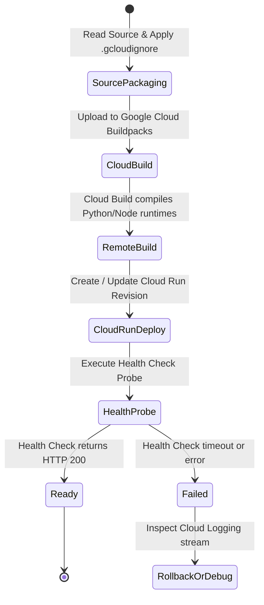

# Data Model: Google Cloud Deployment Without Docker

**Feature**: [spec.md](file:///c:/Users/Karth/hacks-projects/agentic_risk_manager/specs/002-deploy-gcp-without-docker/spec.md) | **Date**: 2026-09-11

This document specifies the operational configuration entities, schema definitions, and state transitions for deploying the Crypto Risk Manager application to Google Cloud Platform natively without Docker.

---

## Entities & Schemas

### 1. CloudDeploymentConfig

Represents the deployment target parameters and compute resources allocated across Google Cloud services.

| Field | Type | Description | Default / Example |
| :--- | :--- | :--- | :--- |
| `project_id` | String | Target Google Cloud Project identifier | (Active gcloud project) |
| `region` | String | Google Cloud deployment region | `us-central1` |
| `backend_service_name` | String | Cloud Run service name for FastAPI backend | `agentic-risk-backend` |
| `frontend_service_name` | String | Cloud Run service name for Next.js web app | `agentic-risk-frontend` |
| `min_instances` | Integer | Minimum scale-to-zero or warm instance count | `0` |
| `max_instances` | Integer | Upper autoscaling bound | `10` |
| `backend_memory` | String | Memory allocation for backend analytics engine | `1Gi` |
| `backend_cpu` | String | vCPU allocation for backend analytics engine | `1` |
| `frontend_memory` | String | Memory allocation for Next.js frontend | `512Mi` |
| `frontend_cpu` | String | vCPU allocation for Next.js frontend | `1` |
| `allow_unauthenticated` | Boolean | Public accessibility via HTTPS | `true` |

---

### 2. ServiceWorkload

Represents an individual deployed compute service on Google Cloud.

| Field | Type | Description | Example |
| :--- | :--- | :--- | :--- |
| `service_id` | String | Qualified service name | `agentic-risk-backend` |
| `service_type` | Enum | Type of workload: `BACKEND` or `FRONTEND` | `BACKEND` |
| `source_dir` | String | Relative path to application source code | `./backend` |
| `entrypoint` | String | Runtime start command or Procfile directive | `web: uvicorn src.api.main:app...` |
| `url` | String (URI) | Public HTTPS endpoint assigned by Google Cloud | `https://agentic-risk-backend-xyz-uc.a.run.app` |
| `deployed_revision` | String | Unique Cloud Run revision tag | `agentic-risk-backend-00001-abc` |
| `status` | Enum | State: `INITIALIZING`, `BUILDING`, `HEALTHY`, `FAILED` | `HEALTHY` |

---

### 3. EnvironmentVariableBinding

Represents injected configuration variables and secrets bound to Cloud Run workloads.

| Field | Type | Description | Target Workload | Sensitive |
| :--- | :--- | :--- | :--- | :--- |
| `PORT` | String | Port assigned dynamically by Cloud Run | Both | No |
| `PRIVY_APP_ID` | String | Privy application ID for wallet authentication | Both | No |
| `PRIVY_APP_SECRET` | String | Privy backend secret for JWT session verification | Backend | Yes |
| `DATABASE_URL` | String | PostgreSQL connection string or SQLite fallback | Backend | Yes |
| `REDIS_URL` | String | Cache connection string (optional) | Backend | Yes |
| `THE_GRAPH_API_KEY` | String | Subgraph query API key for balance discovery | Backend | Yes |
| `COINGECKO_API_KEY` | String | CoinGecko API key for live market pricing | Backend | Yes |
| `NEXT_PUBLIC_API_URL`| String | Public base URL of the deployed backend API | Frontend | No |

---

### 4. HealthCheckResult

Represents the diagnostic verification output when testing deployed service endpoints.

| Field | Type | Description | Example |
| :--- | :--- | :--- | :--- |
| `timestamp` | ISO-8601 String | Execution time of health probe | `2026-09-11T13:55:00Z` |
| `target_url` | String | Public URL probed | `https://agentic-risk-backend-xyz.run.app/health` |
| `http_status` | Integer | HTTP response status code | `200` |
| `latency_ms` | Integer | Round-trip latency in milliseconds | `124` |
| `status` | String | Service status string | `"ok"` |
| `version` | String | Application version tag | `"0.1.0"` |
| `database_connected` | Boolean | Status of database connectivity | `true` |

---

## State Transition Flow

