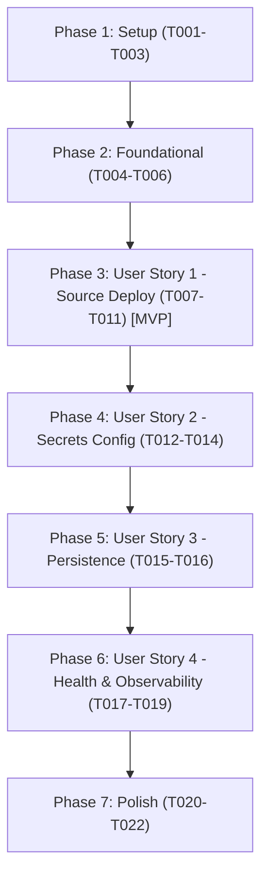

# Tasks: Deploy Entire Application to Google Cloud Without Docker

**Feature**: [spec.md](file:///c:/Users/Karth/hacks-projects/agentic_risk_manager/specs/002-deploy-gcp-without-docker/spec.md) | **Plan**: [plan.md](file:///c:/Users/Karth/hacks-projects/agentic_risk_manager/specs/002-deploy-gcp-without-docker/plan.md) | **Date**: 2026-09-11

## Phase 1: Setup (Shared Infrastructure)

**Purpose**: Establish source exclusion rules, packaging manifests, and environment templates required for remote cloud builds.

- [X] T001 Create backend source exclusion rules in `backend/.gcloudignore` to exclude virtual environments, caches, test artifacts, and local databases from upload
- [X] T002 [P] Create frontend source exclusion rules in `frontend/.gcloudignore` to exclude node_modules, .next build output, and local environment files from upload
- [X] T003 [P] Create production deployment environment template in `.env.gcp.example` defining required API keys and connection parameters

---

## Phase 2: Foundational (Blocking Prerequisites)

**Purpose**: Core runtime and entrypoint definitions required before deploying any services to Google Cloud Run.

*CRITICAL: Must be completed before User Story deployments can run.*

- [X] T004 Configure backend Cloud Run Buildpack entrypoint and process command in `backend/Procfile`
- [X] T005 [P] Configure frontend dynamic port binding for Cloud Run in `frontend/package.json` start script
- [X] T006 [P] Verify backend dependency manifest and production entrypoint compatibility in `backend/requirements.txt` and `backend/src/api/main.py`

**Checkpoint**: Runtime entrypoints and packaging manifests ready — cloud deployment workflow can now execute.

---

## Phase 3: User Story 1 - One-Action Source-to-Cloud Deployment (Priority: P1) 🎯 MVP

**Goal**: Deploy both backend and frontend workloads to Google Cloud Run directly from source files using Google Cloud Buildpacks with zero local Docker engine installation or container daemon commands.

**Independent Test**: Execute the deployment script from a workstation without Docker; verify both backend and frontend are provisioned on Cloud Run with public HTTPS endpoints and communicate seamlessly.

### Implementation for User Story 1

- [X] T007 [P] [US1] Implement automated Windows deployment script core in `deploy-gcp.ps1` with project and region resolution
- [X] T008 [P] [US1] Implement automated POSIX deployment script core in `deploy-gcp.sh` with argument parsing and prerequisites checks
- [X] T009 [US1] Implement backend Cloud Run deployment step in `deploy-gcp.ps1` targeting `backend/` via `gcloud run deploy --source .`
- [X] T010 [US1] Implement frontend Cloud Run deployment step in `deploy-gcp.ps1` targeting `frontend/` with dynamic `NEXT_PUBLIC_API_URL` binding
- [X] T011 [US1] Implement backend and frontend Cloud Run deployment steps in `deploy-gcp.sh` matching the PowerShell automation workflow

**Checkpoint**: User Story 1 is fully functional. The complete application can be built remotely and served from Google Cloud without local Docker.

---

## Phase 4: User Story 2 - Secure Environment Configuration & Secrets Provisioning (Priority: P2)

**Goal**: Securely supply production API credentials (Privy, The Graph, CoinGecko, database connection) to Cloud Run without committing secrets to Git or exposing them in public build logs.

**Independent Test**: Populate `.env.gcp` or pass environment flags, deploy the services, and verify that runtime configurations are correctly ingested and operational without committing secrets to the repository.

### Implementation for User Story 2

- [X] T012 [P] [US2] Implement environment variable parsing and Cloud Run parameter injection (`--set-env-vars`) in `deploy-gcp.ps1`
- [X] T013 [P] [US2] Implement environment variable parsing and Cloud Run parameter injection (`--set-env-vars`) in `deploy-gcp.sh`
- [X] T014 [US2] Implement runtime configuration validation and secret presence logging in `backend/src/config.py`

**Checkpoint**: User Stories 1 and 2 work in combination. Services run with secure, externalized configuration.

---

## Phase 5: User Story 3 - Persistent Application State & Data Continuity (Priority: P3)

**Goal**: Ensure portfolio positions, trade blotter entries, and risk assessments persist across serverless instance scaling and rolling redeployments.

**Independent Test**: Create sample portfolio records in the deployed application, trigger a service restart or revision update, and verify all data remains intact upon recovery.

### Implementation for User Story 3

- [X] T015 [US3] Configure database connection handling for Cloud SQL PostgreSQL and persistent SQLite fallback in `backend/src/database.py`
- [X] T016 [US3] Add Cloud SQL instance connection parameter (`--add-cloudsql-instances`) support in `deploy-gcp.ps1` and `deploy-gcp.sh`

**Checkpoint**: User Stories 1, 2, and 3 work together. Application state is preserved across container lifecycles.

---

## Phase 6: User Story 4 - Continuous Operational Observability & Health Verification (Priority: P4)

**Goal**: Provide health probe endpoints and automated deployment verification to inspect service availability and cloud logging output.

**Independent Test**: Query `GET /health` on the deployed backend service and verify that HTTP 200 is returned with structured diagnostic information; verify logs appear in Google Cloud Logging.

### Implementation for User Story 4

- [X] T017 [US4] Implement unauthenticated health probe endpoint conforming to health-api-contract in `backend/src/api/main.py`
- [X] T018 [P] [US4] Implement post-deployment health check ping and status verification in `deploy-gcp.ps1`
- [X] T019 [P] [US4] Implement post-deployment health check ping and status verification in `deploy-gcp.sh`

**Checkpoint**: All user stories complete. Services have health verification, structured logging, and automated deployment validation.

---

## Phase 7: Polish & Cross-Cutting Concerns

**Purpose**: Documentation updates, security hygiene, and quickstart validation.

- [X] T020 [P] Document Google Cloud deployment prerequisites, commands, and architecture in `README.md`
- [X] T021 [P] Validate end-to-end quickstart procedures against `specs/002-deploy-gcp-without-docker/quickstart.md`
- [X] T022 Review `.gitignore` and `.gcloudignore` across all directories to ensure zero secrets, credentials, or database files leak into source control

---

## Dependencies & Execution Order

### Phase Dependencies

### User Story Dependencies

- **User Story 1 (P1)**: Depends on Foundational Phase (Phase 2). No dependencies on subsequent user stories. Can be deployed and tested independently as the MVP.
- **User Story 2 (P2)**: Enhances deployment scripts and backend config with secure environment injection.
- **User Story 3 (P3)**: Builds upon deployed database configurations to ensure data persistence across service restarts.
- **User Story 4 (P4)**: Integrates health verification into the deployment scripts and backend entrypoints.

### Parallel Opportunities

- `T002` and `T003` can run in parallel with `T001`.
- `T005` and `T006` can run in parallel with `T004`.
- `T007` (PowerShell core) and `T008` (Bash core) can be developed in parallel.
- `T012` and `T013` can be developed in parallel.
- `T018` and `T019` can be developed in parallel.
- `T020` and `T021` can be completed in parallel.

---

## Implementation Strategy

### MVP First (User Story 1 Only)

1. Complete Phase 1: Setup (`.gcloudignore` files and `.env.gcp.example`).
2. Complete Phase 2: Foundational (`Procfile`, dynamic port binding in `package.json`).
3. Complete Phase 3: User Story 1 (`deploy-gcp.ps1` and `deploy-gcp.sh` deployment commands).
4. **STOP and VALIDATE**: Run `deploy-gcp.ps1` to verify successful source deployment to Google Cloud Run without Docker.

### Incremental Delivery

1. Phase 1 + Phase 2 + Phase 3 → Working Cloud Run source deployment (MVP).
2. Phase 4 → Secure secrets injection (`--set-env-vars`).
3. Phase 5 → Cloud SQL persistence and SQLite fallback assurance.
4. Phase 6 → `/health` probe and automated deployment validation ping.
5. Phase 7 → Final documentation, `.gitignore` validation, and hygiene review.
